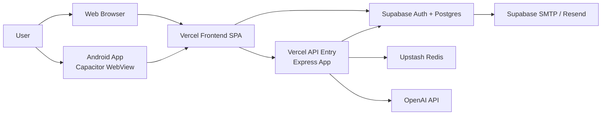
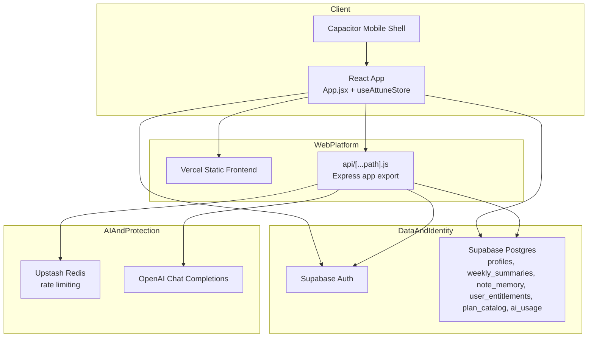

# System Architecture Overview

## Summary

Attune is a mobile-first React application with a local-first user experience and a production backend split across Vercel, Supabase, Upstash, and OpenAI.

The frontend is responsible for UI, local interaction state, and direct user-owned CRUD against Supabase. The backend API is responsible for server-only decisions such as auth token verification, plan/quota enforcement, rate limiting, AI usage logging, and OpenAI calls.

## High-Level Context

## Runtime Boundaries

- Browser / WebView:
Runs the React app, keeps session state, and performs authenticated CRUD through the Supabase client.
- Vercel API:
Runs the Express backend for AI endpoints and privileged server logic.
- Supabase:
Owns identity, persistent relational data, and row-level access control.
- Upstash:
Owns durable rate-limit counters for serverless-safe throttling.
- OpenAI:
Returns structured AI outputs after the Attune API prepares and validates requests.

## Container View

## Main User Flows

- Auth flow:
Frontend requests an OTP from Supabase, user verifies with an emailed code, session is stored locally, and profile/remote data are synced into store state.
- Daily planning flow:
User checks in, Attune computes a pace, and Activity Picker loads built-in or AI-generated tasks.
- AI flow:
Frontend sends an authenticated request to the API, which validates auth, limits, plan, and payload before calling OpenAI.
- Sync flow:
Profiles, weekly summaries, and note memory are read and written directly through Supabase client helpers under RLS.

## Canonical Code Entry Points

- Frontend app shell: [src/app/App.jsx](../../app/App.jsx)
- Global state: [src/store/useAttuneStore.js](../../store/useAttuneStore.js)
- Supabase client: [src/lib/supabase.js](../../lib/supabase.js)
- Backend API: [server/index.js](../../../server/index.js)
- Vercel serverless entrypoint: [api/[...path].js](../../../api/%5B...path%5D.js)