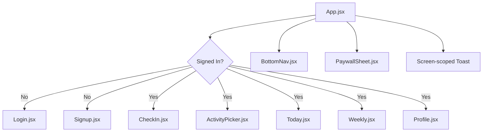

# Frontend Architecture Guide

## Frontend Summary

The frontend is a React 19 + Vite SPA with a central store-driven architecture. There is no client-side router; screen changes are driven by `state.screen` in the global store.

The app favors one shared state model rather than many disconnected local state trees. This keeps core flows like auth, check-in, My Day, weekly reflection, note memory, paywall state, AI state, and toasts coordinated from one place.

## Main Composition

- Entry point: [src/main.jsx](../../main.jsx)
- App shell: [src/app/App.jsx](../../app/App.jsx)
- Boot hook: [src/hooks/useAppInit.js](../../hooks/useAppInit.js)
- Global store: [src/store/useAttuneStore.js](../../store/useAttuneStore.js)

## Screen Model

Attune currently renders screens by switching on `state.screen`.

- `checkin`
- `wheel` for Activity Picker
- `today`
- `week`
- `profile`

When the user is not signed in, the app renders `Login` or `Signup` based on `state.auth.view`.

## Frontend Screen Diagram

## Global Store Responsibilities

The store in [src/store/useAttuneStore.js](../../store/useAttuneStore.js) is the real application core.

It owns:

- auth state and OTP actions
- current screen and navigation actions
- daily check-in state
- pace and suggestion level state
- task board options and My Day state
- weekly summaries and event history
- note memory state
- profile state, including `useNoteForAi`
- AI board and AI daily note request state
- toasts and ephemeral paywall state

## Persistence Model

The UX is designed to feel local-first.

- Local persistence: [src/lib/storage.js](../../lib/storage.js) stores the main app state in localStorage.
- Remote persistence: profile, weekly summaries, and note memory synchronize to Supabase for signed-in users.
- Non-persistent UI state: toasts and paywall state are ephemeral.

## Frontend Data Helpers

- Profile CRUD: [src/lib/profileApi.js](../../lib/profileApi.js)
- Weekly summaries CRUD: [src/lib/weeklySummariesApi.js](../../lib/weeklySummariesApi.js)
- Note memory CRUD: [src/lib/noteMemoryApi.js](../../lib/noteMemoryApi.js)
- Built-in suggestion fallback: [src/lib/attuneEngine.js](../../lib/attuneEngine.js)

## Key Frontend Invariants

- Activity Picker expects 15 tasks when AI succeeds.
- My Day uses a soft cap and a hard cap to reduce overwhelm.
- Toasts are scoped to the current screen.
- Weekly reflection is keyed to calendar week.
- The optional note can be excluded from AI requests via profile preference.

## What a New Engineer Should Not Assume

- There is no React Router-driven route tree.
- The store is not optional glue; it is the product workflow engine.
- The frontend is not purely local anymore; it now depends on Supabase auth and remote sync.
- AI generation is not a client SDK integration; it always goes through the Attune API.