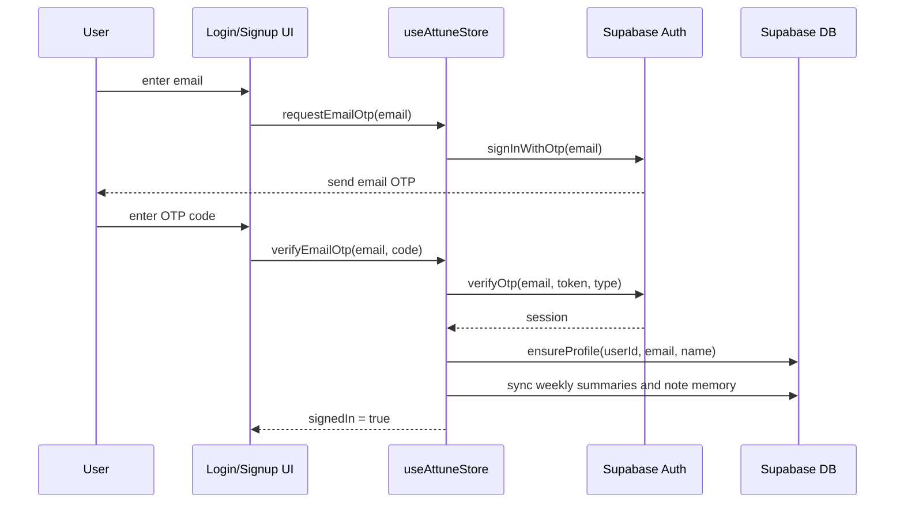
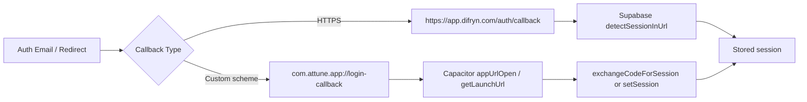

# Authentication Architecture

## Summary

Attune uses Supabase email OTP authentication. The frontend requests an OTP, the user enters the emailed code, Supabase verifies it, and the app stores the resulting session locally.

This replaced the earlier fragile magic-link-first approach. Some deep-link callback support still exists for mobile and hosted callback handling, but the primary user-facing flow is typed OTP.

## Key Files

- Supabase client config: [src/lib/supabase.js](../../lib/supabase.js)
- Mobile auth/deep-link helpers: [src/lib/mobile.js](../../lib/mobile.js)
- App init: [src/hooks/useAppInit.js](../../hooks/useAppInit.js)
- Auth UI: [src/screens/Login.jsx](../../screens/Login.jsx), [src/screens/Signup.jsx](../../screens/Signup.jsx)
- Auth actions and state: [src/store/useAttuneStore.js](../../store/useAttuneStore.js)

## Auth State Model

The store tracks:

- `view`: `signin` or `signup`
- `step`: `request` or `verify`
- `status`: `idle`, `sending`, `sent`, `verifying`, or `error`
- `sentTo`, `otpCode`, `error`
- `signedIn`, `userId`, `username`

## Web OTP Sequence

## Verification Details

For verification, the store tries multiple Supabase verification types because sign-in and sign-up flows can map differently at the API layer.

- Sign-up preference order: `signup`, `magiclink`, `email`
- Sign-in preference order: `magiclink`, `email`, `signup`

This behavior lives in [src/store/useAttuneStore.js](../../store/useAttuneStore.js).

## Session Bootstrap and Listener

On startup, the app:

1. builds the Supabase client
2. reads the current session
3. ensures a profile row exists
4. syncs weekly summaries and note memory from Supabase
5. subscribes to `onAuthStateChange`

This is implemented in the main auth bootstrap effect inside [src/store/useAttuneStore.js](../../store/useAttuneStore.js).

## Native / Hosted Callback Support

Even though typed OTP is primary, Attune still supports callback-based session establishment for mobile and hosted auth flows.

- Web callback path: `/auth/callback`
- Native fallback deep link: `com.attune.app://login-callback/`
- Preferred Android production flow: verified HTTPS App Link

## Mobile Callback Flow

## Auth-Related Environment and Platform Requirements

- Frontend:
  - `VITE_SUPABASE_URL`
  - `VITE_SUPABASE_ANON_KEY`
  - `VITE_PUBLIC_APP_URL` or `VITE_AUTH_REDIRECT_URL` for hosted callbacks
- Backend:
  - `SUPABASE_URL`
  - `SUPABASE_ANON_KEY`
  - `SUPABASE_SERVICE_ROLE_KEY`
- Hosting:
  - `/auth/callback` must rewrite to the SPA entrypoint on Vercel

## Current Risks / Watchpoints

- Auth docs in older files may still refer to local-only or magic-link-first behavior.
- Android App Links still require release-grade `assetlinks.json` and certificate setup for final shipping.