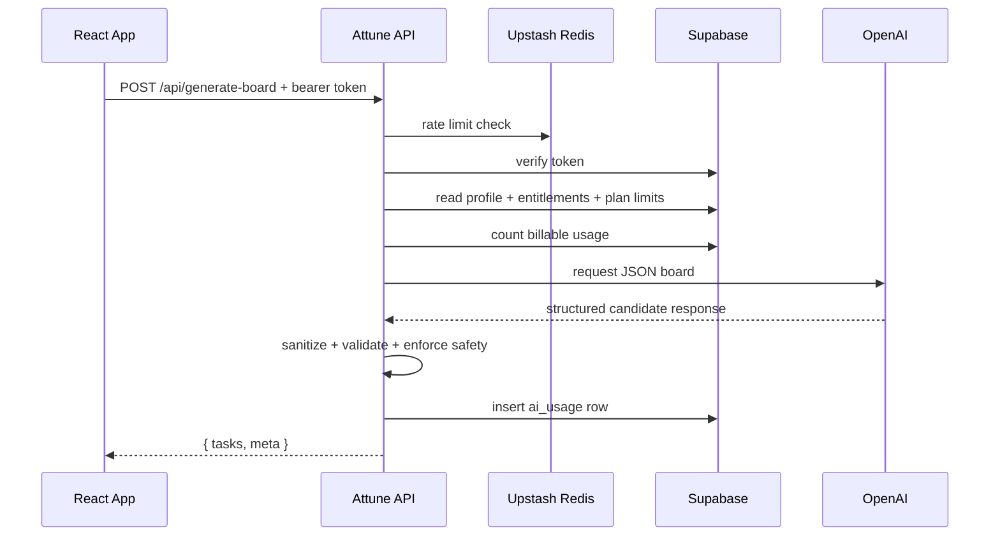
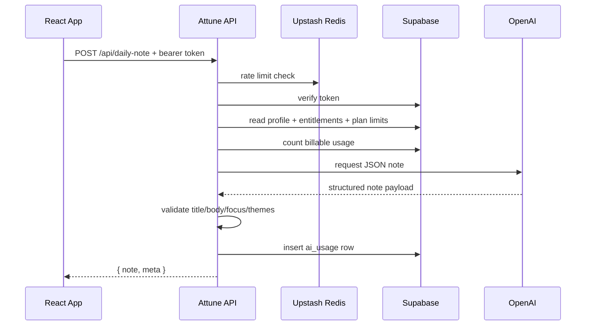

# AI Backend Architecture

## Summary

Attune exposes two AI endpoints through the Express backend in [server/index.js](../../../server/index.js):

- `POST /api/generate-board`
- `POST /api/daily-note`

Both endpoints are served locally by `node server/index.js` in development and through [api/[...path].js](../../../api/%5B...path%5D.js) on Vercel in production.

## Backend Responsibilities

The backend does more than proxy an OpenAI call. It is the trust boundary for:

- bearer token verification with Supabase
- origin checks for browser requests
- Upstash-backed rate limiting
- plan and quota enforcement using Supabase data
- note privacy enforcement through `use_note_for_ai`
- server-side OpenAI calls
- schema validation and sanitization of model output
- usage logging to `ai_usage`

## Endpoint Overview

- `/api/health`
Simple health probe used to verify the API is alive.
- `/api/generate-board`
Generates a strict 12-task board matched to current check-in context.
- `/api/daily-note`
Generates a short daily note plus optional themes.

## Generate Board Sequence

## Daily Note Sequence

## Quota and Plan Logic

Plan and quota logic are derived from:

- `plan_catalog`
- `user_entitlements`
- `profiles.use_note_for_ai`
- `ai_usage`
- `count_billable_ai_usage(...)`

The backend resolves the effective plan, reads the configured daily and monthly AI limits, and blocks requests when usage exceeds the limit.

## Rate Limiting Model

- Production: Upstash Redis sliding window limiter
- Local fallback: in-memory limiter inside the Node process
- Current keys are IP-based for burst protection

The backend still also uses database-backed quota enforcement, so rate limiting and quota control are layered rather than interchangeable.

## Caching Model

The API keeps a short-lived in-memory cache for board and note responses.

- Board cache TTL: 10 minutes
- Daily note cache TTL: 10 minutes

In production on Vercel this cache is opportunistic because serverless instances are ephemeral. It improves warm-instance reuse but is not a durable cache.

## AI Safety and Validation

The backend deliberately does not trust the model output directly.

For `generate-board`, it:

- requests JSON-only responses
- filters out week-level reflection tasks
- validates 15 short task strings for safety, grounding, and duplicates
- fills missing slots with safe fallbacks if needed

For `daily-note`, it:

- requests a narrow note schema
- validates title/body/focus/themes
- constrains themes to Attune-supported values

## Failure Behavior

- Frontend board fallback:
If `/api/generate-board` fails, the app falls back to built-in suggestions.
- Frontend daily note fallback:
The store keeps the AI daily note state in `error` and can continue without a generated note.
- Recoverable backend failures:
Configuration, quota, rate limits, and upstream model problems are returned as structured errors.

## Key Files

- Backend implementation: [server/index.js](../../../server/index.js)
- Vercel API export: [api/[...path].js](../../../api/%5B...path%5D.js)
- Frontend board caller: [src/store/useAttuneStore.js](../../store/useAttuneStore.js)
- Built-in fallback engine: [src/lib/attuneEngine.js](../../lib/attuneEngine.js)
