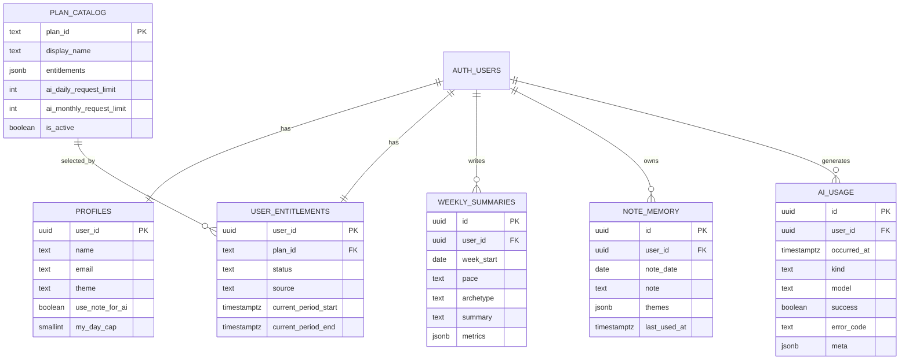
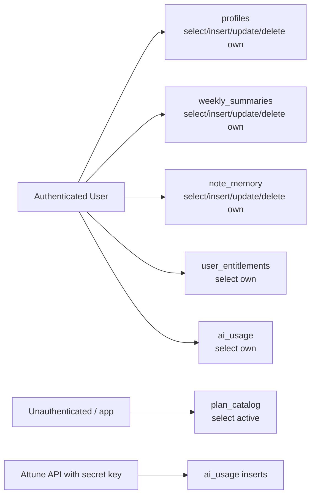

# Data Model and Supabase Guide

## Summary

Supabase Postgres is the persistent system of record for signed-in Attune users. The current schema source of truth is [supabase/migrations/20260328110216_attune_minimal_v1.sql](../../../supabase/migrations/20260328110216_attune_minimal_v1.sql).

## Main Tables

- `plan_catalog`
Defines available plans and AI limits.
- `user_entitlements`
Stores the effective plan and billing state per user.
- `profiles`
Stores name, email, theme, note privacy preference, and My Day cap.
- `weekly_summaries`
Stores one summary per user per calendar week.
- `note_memory`
Stores one note memory row per user per local day.
- `ai_usage`
Stores billable and non-billable AI usage events.

## ER Diagram

## Row Ownership Model

- `profiles`
One row per user.
- `user_entitlements`
One row per user.
- `weekly_summaries`
Many rows per user, unique on `(user_id, week_start)`.
- `note_memory`
Many rows per user, unique on `(user_id, note_date)`.
- `ai_usage`
Many rows per user, written by the backend.

## RLS Overview

## Trigger and Function Model

- `set_updated_at()`
Used by multiple tables to maintain `updated_at` automatically.
- `count_billable_ai_usage(...)`
Used by the API to compute daily/monthly usage.
- `handle_new_user()`
Runs after `auth.users` insert to ensure a profile row and default free entitlement exist.

## Client Sync Model

The frontend writes directly to Supabase under RLS for user-owned records.

- Profile sync: [src/lib/profileApi.js](../../lib/profileApi.js)
- Weekly summaries sync: [src/lib/weeklySummariesApi.js](../../lib/weeklySummariesApi.js)
- Note memory sync: [src/lib/noteMemoryApi.js](../../lib/noteMemoryApi.js)

The store hydrates these on session startup and auth state changes.

## Important Distinction

Attune is not fully backend-mediated. It is a hybrid model:

- Direct client-to-Supabase for user-owned CRUD under RLS
- Backend-to-Supabase for privileged auth verification, AI quota logic, and `ai_usage` writes

That distinction is central to understanding the current architecture.