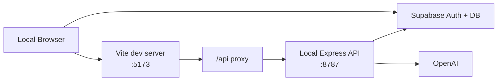
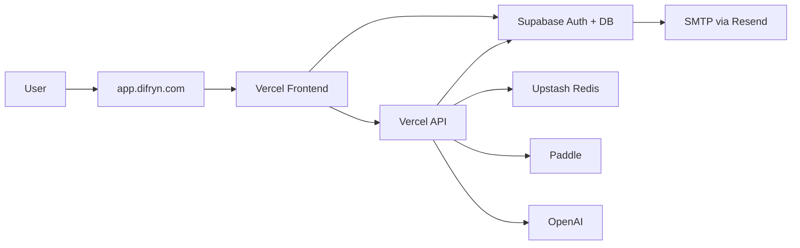
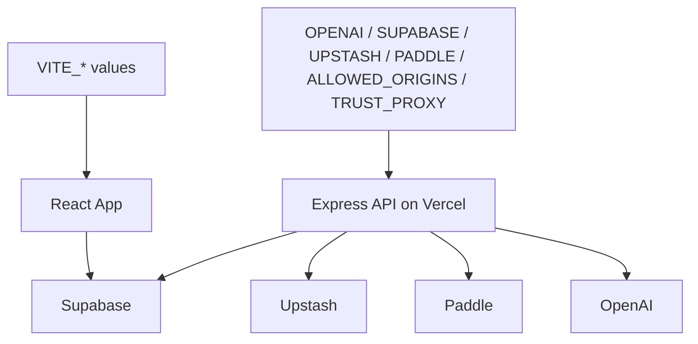

# Deployment and Environment Guide

## Summary

Attune currently runs as a multi-service deployment:

- frontend SPA on Vercel
- API entrypoint on Vercel
- auth and database on Supabase
- rate limiting on Upstash Redis
- email delivery through Supabase Auth with custom SMTP / Resend

## Development Topology



## Production Topology



## Environment Variable Ownership

### Frontend variables

- `VITE_SUPABASE_URL`
- `VITE_SUPABASE_ANON_KEY`
- `VITE_PUBLIC_APP_URL`
- `VITE_AUTH_REDIRECT_URL`
- `VITE_AUTH_CALLBACK_PATH`
- `VITE_PADDLE_CLIENT_TOKEN`
- `VITE_PADDLE_PLUS_PRICE_ID`
- `VITE_PADDLE_ENV`

These are build-time frontend config values.

### Backend variables

- `OPENAI_API_KEY`
- `OPENAI_MODEL`
- `SUPABASE_URL`
- `SUPABASE_ANON_KEY`
- `SUPABASE_SERVICE_ROLE_KEY`
- `PADDLE_API_KEY`
- `PADDLE_WEBHOOK_SECRET`
- `PADDLE_PLUS_PRICE_ID`
- `ALLOWED_ORIGINS`
- `TRUST_PROXY`
- `UPSTASH_REDIS_REST_URL`
- `UPSTASH_REDIS_REST_TOKEN`

These must stay server-side only.

## Environment Ownership Map



## Key Config Files

- Vercel rewrite: [vercel.json](../../../vercel.json)
- Vite dev proxy: [vite.config.js](../../../vite.config.js)
- Package scripts: [package.json](../../../package.json)
- Capacitor config: [capacitor.config.ts](../../../capacitor.config.ts)
- Example env file: [.env.example](../../../.env.example)

## Build and Run Commands

- `npm run dev`
Frontend only
- `npm run api`
API only
- `npm run dev:all`
Frontend + API
- `npm run build`
Production frontend build
- `npm run cap:sync`
Build web assets and sync into Android project

## Supabase Migration Rollout

Apply these migrations in timestamp order:

1. `20260401153000_play_store_purchases.sql`
2. `20260403130000_note_memory_plus_only.sql`
3. `20260403141000_ai_quota_reservations.sql`
4. `20260403142000_user_entitlements_add_stripe_source.sql`
5. `20260403153000_user_entitlements_add_paddle_source.sql`

If the Supabase CLI is available on your deployment machine, run the normal migration push flow there.

If CLI access is blocked, open the Supabase SQL Editor and apply the five migration files in the same order.

### Required post-migration checks

Run these checks after applying the migrations:

```sql
select to_regclass('public.play_store_purchases');

select policyname
from pg_policies
where schemaname = 'public'
    and tablename = 'note_memory'
order by policyname;

select proname
from pg_proc
where proname = 'reserve_ai_usage_quota';

select conname
from pg_constraint
where conrelid = 'public.user_entitlements'::regclass
    and conname = 'user_entitlements_source_check';
```

Expected results:

- `public.play_store_purchases` exists
- `note_memory_*_plus_only` policies exist
- `reserve_ai_usage_quota` exists
- `user_entitlements_source_check` exists with `stripe` and `paddle` allowed as sources

### Rollback note

Do not deploy the new billing code before these migrations are live. The runtime now expects:

- `play_store_purchases` for verified Google Play purchases
- Plus-only `note_memory` RLS policies
- `reserve_ai_usage_quota(...)` for atomic AI quota reservations
- `stripe` and `paddle` as valid `user_entitlements.source` values

## Production Hosting Notes

- `/auth/callback` is rewritten to `/` so the SPA can boot and complete auth handling.
- `/api/*` is now served by the Vercel API entrypoint instead of relying on a separate host.
- `ALLOWED_ORIGINS` must include the live frontend origin.
- `TRUST_PROXY=1` should be set on Vercel so request IP handling is correct.
- Paddle webhooks should point to `/api/billing/paddle/webhook` on the same deployment.

## What a New Engineer Should Verify First in Production

1. `https://app.difryn.com/api/health`
2. login / signup OTP flow
3. generate-board
4. daily-note
5. weekly summary sync
6. note memory sync
7. Paddle checkout completion
8. Paddle webhook delivery and entitlement sync