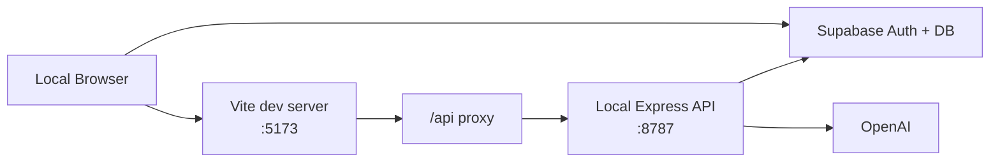
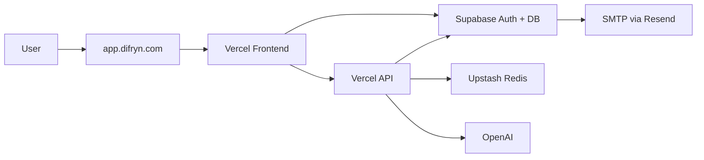
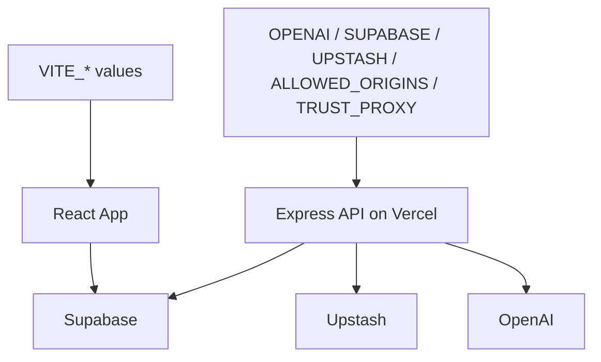

# Deployment and Environment Guide

## Summary

Attune currently runs as a multi-service deployment:

- frontend SPA on Vercel
- API entrypoint on Vercel
- auth and database on Supabase
- rate limiting on Upstash Redis
- email delivery through Supabase Auth with custom SMTP / Resend

## Development Topology

## Production Topology

## Environment Variable Ownership

### Frontend variables

- `VITE_SUPABASE_URL`
- `VITE_SUPABASE_ANON_KEY`
- `VITE_PUBLIC_APP_URL`
- `VITE_AUTH_REDIRECT_URL`
- `VITE_AUTH_CALLBACK_PATH`

These are build-time frontend config values.

### Backend variables

- `OPENAI_API_KEY`
- `OPENAI_MODEL`
- `SUPABASE_URL`
- `SUPABASE_ANON_KEY`
- `SUPABASE_SERVICE_ROLE_KEY`
- `ALLOWED_ORIGINS`
- `TRUST_PROXY`
- `UPSTASH_REDIS_REST_URL`
- `UPSTASH_REDIS_REST_TOKEN`

These must stay server-side only.

## Environment Ownership Map

## Key Config Files

- Vercel rewrite: [vercel.json](../../../vercel.json)
- Vite dev proxy: [vite.config.js](../../../vite.config.js)
- Package scripts: [package.json](../../../package.json)
- Capacitor config: [capacitor.config.ts](../../../capacitor.config.ts)
- Example env file: [.env.example](../../../.env.example)

## Build and Run Commands

- `npm run dev`
Frontend only
- `npm run api`
API only
- `npm run dev:all`
Frontend + API
- `npm run build`
Production frontend build
- `npm run cap:sync`
Build web assets and sync into Android project

## Production Hosting Notes

- `/auth/callback` is rewritten to `/` so the SPA can boot and complete auth handling.
- `/api/*` is now served by the Vercel API entrypoint instead of relying on a separate host.
- `ALLOWED_ORIGINS` must include the live frontend origin.
- `TRUST_PROXY=1` should be set on Vercel so request IP handling is correct.

## What a New Engineer Should Verify First in Production

1. `https://app.difryn.com/api/health`
2. login / signup OTP flow
3. generate-board
4. daily-note
5. weekly summary sync
6. note memory sync