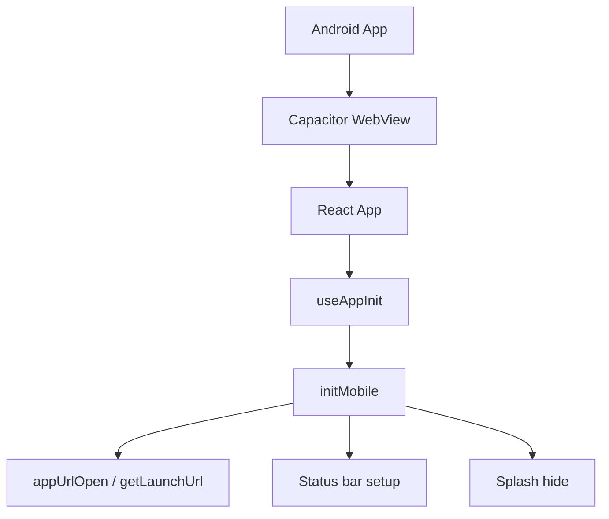
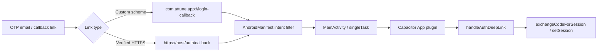

# Mobile Architecture and Release Guide

## Summary

Attune uses Capacitor to package the web app into an Android application. The mobile app is not a separate native implementation; it is the same React app running inside a WebView with mobile-specific boot and auth integration.

## Key Files

- Capacitor config: [capacitor.config.ts](../../../capacitor.config.ts)
- Android manifest: [android/app/src/main/AndroidManifest.xml](../../../android/app/src/main/AndroidManifest.xml)
- Gradle auth placeholders: [android/gradle.properties](../../../android/gradle.properties)
- Mobile helpers: [src/lib/mobile.js](../../lib/mobile.js)
- App init hook: [src/hooks/useAppInit.js](../../hooks/useAppInit.js)

## Mobile Boot Responsibilities

At startup, Attune:

- initializes Capacitor-specific mobile behavior
- installs auth deep-link listeners
- reads cold-start URLs via `getLaunchUrl()`
- applies theme to the document
- configures status bar appearance
- hides the splash screen
- prevents input zoom on mobile

## Mobile Architecture Diagram

## Auth on Mobile

There are two mobile callback paths:

- fallback custom scheme:
  - `com.attune.app://login-callback/`
- preferred production path:
  - verified HTTPS App Link using `ATTUNE_AUTH_HOST` and `ATTUNE_AUTH_PATH_PREFIX`

## Android Deep Link Model

## Release-Sensitive Mobile Settings

- `ATTUNE_AUTH_HOST`
Host for verified Android App Links
- `ATTUNE_AUTH_PATH_PREFIX`
Path prefix for hosted callback handling
- `assetlinks.json`
Must be hosted under `/.well-known/assetlinks.json`
- release certificate fingerprint
Must match the signing certificate that will handle the app links

## Current Mobile Reality

- The Android shell exists and is wired for deep links.
- The hosted auth path is the intended production direction.
- Custom scheme remains available as fallback.
- Final Play Store grade App Link verification still depends on release certificate + hosted `assetlinks.json`.

## Mobile Release Checklist

1. Set final auth host and callback path in [android/gradle.properties](../../../android/gradle.properties).
2. Host `assetlinks.json` on the real domain.
3. Verify release certificate fingerprint.
4. Run `npm run cap:sync`.
5. Test sign-in on a real Android device.
6. Confirm auth callback reaches the app without manual intervention.