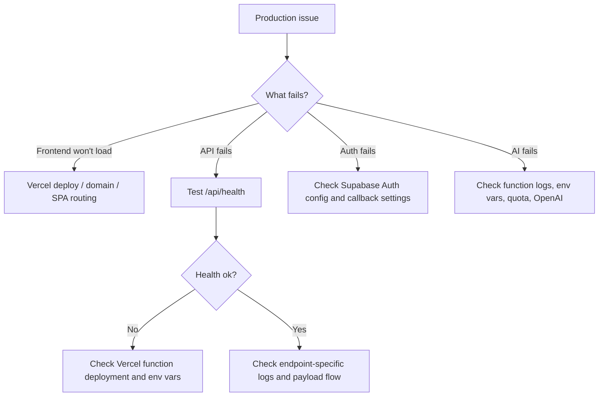

# Operations Runbook

## Purpose

This runbook is the practical guide for operating Attune in development and production.

## Fast Health Checks

1. Frontend loads at the primary domain.
2. `GET /api/health` returns `{"ok":true}`.
3. OTP sign-in works.
4. `generate-board` works.
5. `daily-note` works.

## Main Observation Points

- Vercel deployment logs for build failures
- Vercel function logs for API runtime failures
- Supabase Auth and SQL behavior for auth or data issues
- Upstash dashboard for rate-limit activity if AI requests are being throttled

## Triage Flow

## Common Failure Modes

### `/api/health` hangs or times out

- likely API entrypoint or deployment shape issue
- check Vercel function routing and recent deploy

### `supabase_auth_not_configured`

- backend env vars are missing or misnamed
- verify `SUPABASE_URL`, `SUPABASE_ANON_KEY`, and `SUPABASE_SERVICE_ROLE_KEY`

### `forbidden_origin`

- `ALLOWED_ORIGINS` does not include the live domain

### `rate_limited`

- Upstash limiter blocked the request burst

### `ai_daily_limit_reached` or `ai_monthly_limit_reached`

- plan or quota logic is working and the user exhausted the allowance

### OpenAI errors or 502 AI failures

- check `OPENAI_API_KEY`
- inspect Vercel function logs for upstream errors or validation failures

## Secret Handling Rules

- never discuss real secret values in docs, tickets, chat, screenshots, or logs
- keep secrets only in local env files and service secret managers
- rotate any key that appears in conversation context, screenshots, attachments, or logs
- never expose server secrets in `VITE_*` variables

## Safe Rotation Procedure

1. Create replacement key in the provider.
2. Update the local env file.
3. Update Vercel production env vars.
4. Redeploy Vercel.
5. Confirm `api/health`, login, `generate-board`, and `daily-note` still work.
6. Revoke the old key.

## Smoke Test Checklist After Any Deploy

1. Open the web app.
2. Sign in with OTP.
3. Complete a check-in.
4. Open Activity Picker and confirm board generation works.
5. Open My Day and ensure tasks can be added and completed.
6. Check Weekly and Profile screens.
7. Verify note memory and daily note behavior.

## Commands Worth Remembering

- `npm run dev`
- `npm run api`
- `npm run dev:all`
- `npm run build`
- `npm run cap:sync`

## Escalation Questions for an Incident

If a new engineer gets stuck, answer these first:

1. Does `api/health` work?
2. Is the failure only in production or also local?
3. Does the failure happen before or after auth?
4. Is it frontend state, Supabase CRUD, or backend AI?
5. Did env vars or secrets change recently?